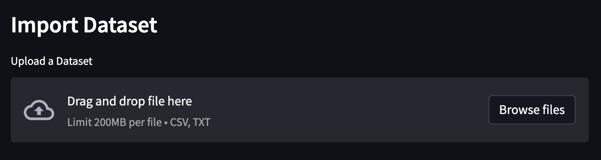
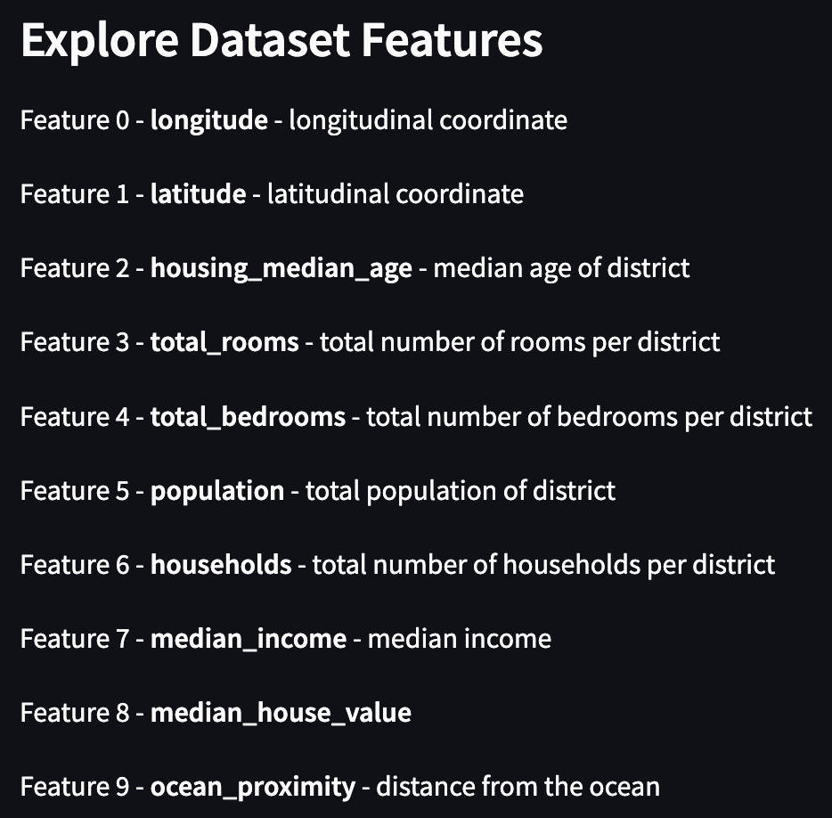
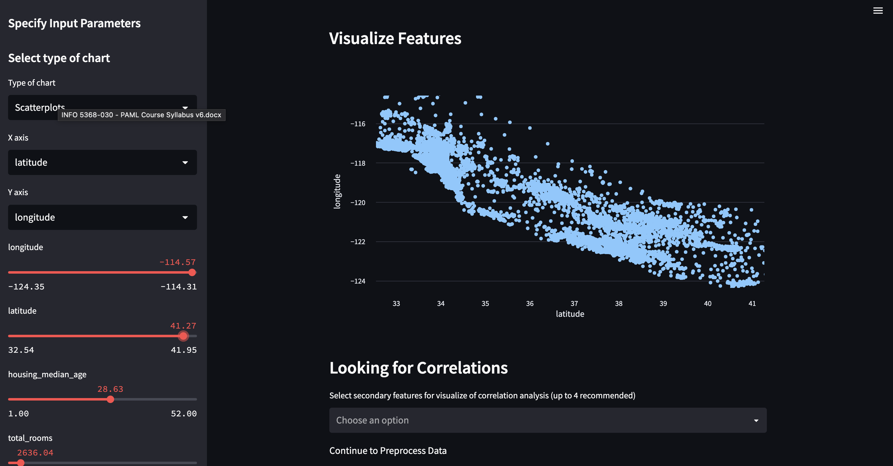
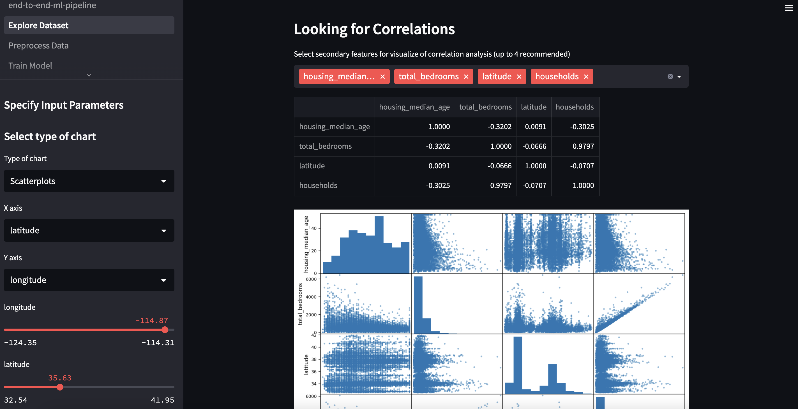
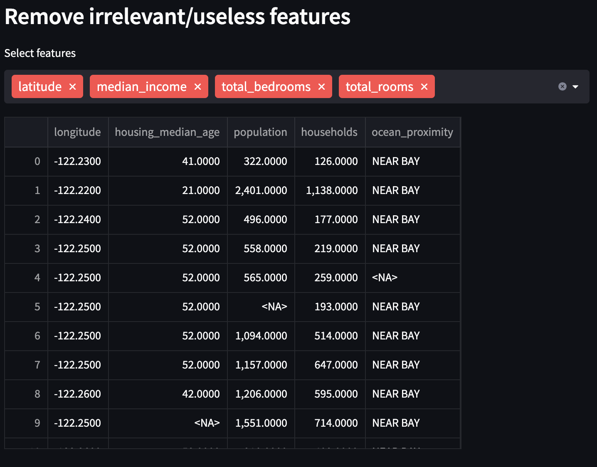
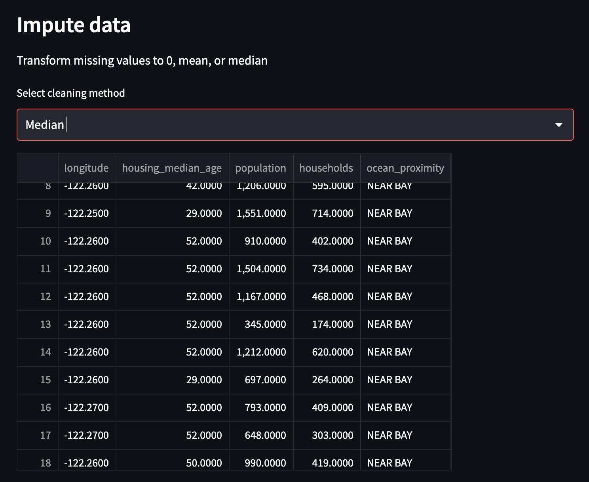
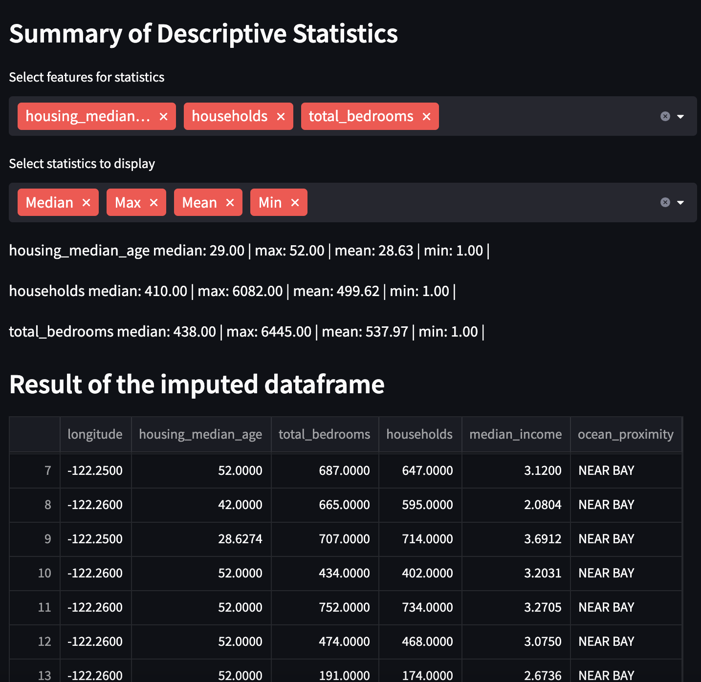
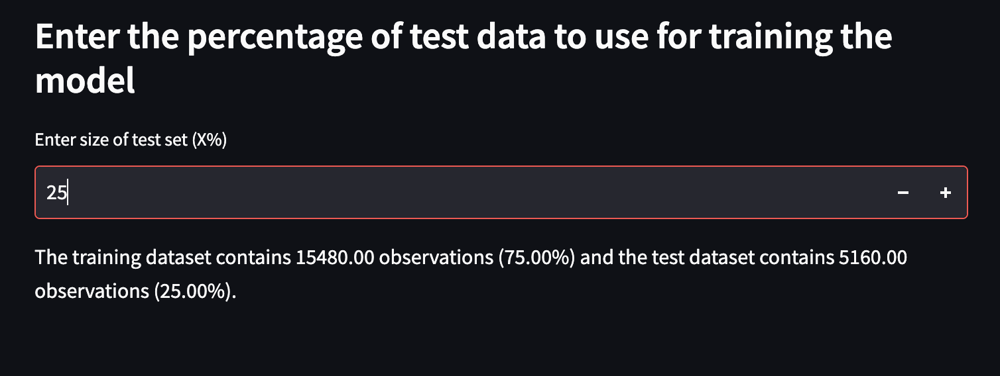

# Practical Applications in Machine Learning - Homework 1

The goal of Homework 1 assignment is to build your first end-to-end Machine Learning (ML) pipeline using public datasets and by creating your own datasets. The <b>learning outcomes</b> for this assignment are: 

* Build framework for end-to-end ML pipeline in Streamlit. Create your first web application! 
* Develop web application that walks users through steps of ML pipeline starting with data visualization and preprocessing steps. 

This assignment is contains two parts:

1. <b>End-to-End ML Pipeline</b>: Many ML projects are NOT used in production or NOT easily used by others including ML engineers interested in exploring prior ML models, testing their models on new datasets, and helping users explore ML models. To address this challenge, the goal of this assignment is to implement a front- and back-end ML project, focusing on the dataset exploration and preprocessing steps. The hope is that the homework assignments help students showcase ML skills in building end-to-end ML pipelines and deploying ML web applications for users which we build on in future assignments. 

2. <b>Dataset Curation (In-Class Activity)</b>: It is often challenging to collect datasets when none exists in your problem domain. Thus, it is important to understand how to curate new datasets and explore existing methodologies for data collection. Part II of HW1 focuses on how to collect datasets, annotate the data, and evaluate the annotations in preparation for ML tasks.

HW1 serves as an outline for the remaining assignments in the course, building end-to-end ML pipelines and deploying useful web applications using those models. This assignment in particular focuses on the data exploration and preprocess. 

* <b>Due</b>:  Friday February 17, 2023 at 11:00PM 
* <b>What to turn in</b>: Submit responses on GitHub AutoGrader
* <b>Assignment Type</b>: Individual
* <b>Time Estimate</b>: 9 Hours
* <b>Submit code via GitHub</b>: https://classroom.github.com/a/fiL30jIe
* <b>Submit Reflection Assessment</b> via Canvas (multiple choice, 5 questions)

<p align="center"> 
 
<i>

<b>Figure:</b> This shows a demonstration of the web application for End-to-End ML pipelines.

# Installation

Install [Streamlit](https://streamlit.io/)
```
pip install streamlit     # Install streamlit
streamlit hello           # Test installation
```

Next, let's update the libraries. First, let's update `conda` itself:
```
conda update -c defaults -n base conda
```

And recreate the environment:
```
conda env create -f environment.yml
```

## Start Jupyter
(Optional) Install Juypter notebook is not installed already.
```
python3 -m ipykernel install --user --name=python3
```

And that's it! You can now start Jupyter like this:
```
jupyter notebook
```

This should open up your browser, and you should see Jupyter's tree view, with the contents of the current directory. 

## Update This Project and its Libraries
I regularly update the notebooks to fix issues and add support for new libraries. So make sure you update this project regularly.

For this, open a terminal, and run:
```
cd $HOME # or whatever development directory you chose earlier
cd homework1 # go to this project's directory
git pull
```

If you get an error, it's probably because you modified a notebook. In this case, before running `git pull` you will first need to commit your changes. I recommend doing this in your own branch, or else you may get conflicts:
```
git checkout -b my_branch # you can use another branch name if you want
git add -u
git commit -m "describe your changes here"
git checkout master
git pull
```

## Run Github AutoGrader
Run Github autograder using the following command in the termal:
```
pytest
```

* end-to-end-ml-pipeline.ipynb: This is the example from the textbook on predicting housing prices. We will use this notebook to create an online ML end-to-end pipeline. We will focus on data collction and preprocessing steps.
* end-to-end-ml-pipeline.py: HW1 assignment template using streamlit for web application UI and workflow of activties. 
* pages/*.py files: Contains code to explore data, preprocess it and prepare it for ML. It includes checkpoints for the homework assignment.
* datasets: folder that conatins the dataset used for HW1 in 'housing/housing.csv'
* notebooks: contains example notebooks for HW1
* test_homework1.py: contains Github autograder functions
* images/: contains images for readme

# 1. Build End-to-End ML Pipeline

The first part of HW1 focuses on ‘Building an End-to-End ML Pipeline’ which consists of creating modules that perform the following tasks: exploring and visualizing the data to gain insights and preprocess and prepare data for machine learning algorithms.

## 1.1 California Housing Dataset

Create useful visualizations for machine learning tasks. This assignment focuses on visualizing features from a dataset given some input .csv file (locally or in the cloud), the application is expected to read the input dataset. Use the pandas read_csv function to read in a local file. Use Streamlit layouts to provide multiple options for interacting with and understanding the dataset.

This assignment involves testing the end-to-end pipeline in a web application using a California Housing dataset from the textbook: Géron, Aurélien. Hands-on machine learning with Scikit-Learn, Keras, and TensorFlow. O’Reilly Media, Inc., 2022 [[GitHub](https://github.com/ageron/handson-ml2)]. The dataset was capture from California census data in 1990 and contains the following features:
* longitude - longitudinal coordinate
* latitude - latitudinal coordinate
* housing_median_age - median age of district
* total_rooms - total number of rooms per district
* total_bedrooms - total number of bedrooms per district
* population - total population of district
* households - total number of households per district'
* median_income - median income
* ocean_proximity - distance from the ocean
* median_house_value - median house value

We will explore these features further in the remaining sections, including in Reflection questions.

## 1.2. Explore and visualize the data to gain insights. 

<b>Task 1</b>: Import data from local machine (<b>Checkpoint 1</b>; 1 point)

The goal of this task is to create ML pipeline modules on two pages. The first step is to upload a dataset and make two columns on the ‘Explore Dataset’ and ‘Preprocess Data’ pages:
Column 1) upload a dataset from your local machine 
Column 2) upload a dataset from a cloud source
Both Columns 3) Restore a dataset from prior pages using Streamlit sessions_state dictionary, update this data structure with variables needed in other pages of the website. 

The ‘Explore Dataset’ and ‘Preprocess Data’ pages require data to be uploaded or restored. Your task is to complete the load_dataset() function on the Explore Dataset page and the restore_dataset() function on the ‘Preprocess Data’ page. Use the following functions to upload data and restore variables from other pages.

st.fileuploader() - function that uploads a file from a users local machine
st.session_state - dictionary that stores that state of variables
pd.read_csv() - function that reads a csv file and store it in a pandas dataframe

```
data = st.file_uploader()
df = pd.read_csv(data)
```

<p align="center"> 
 
<i>

<b>Figure:</b> This shows an example of adding a button to upload a dataset (Checkpoint 1).

Next, explore dataset features using helper functions to summarize features in the dataset and visualize them on a plot (see figures below). Provide the option to select one plot to display including Scatterplots, Lineplots, Histogram, and Boxplot using the Streamlit selectbox function. Once a plot has been selected, the visualization should update with the appropriate figure. Use the user_input_features function to collect filters for each figure and update the plot accordingly.

<p align="center"> 
 
<i>

<b>Figure:</b> Summary of features in the Housing dataset.

<p align="center"> 
 
<i>

<b>Figure:</b> Example visualization of latitude and longitude features.

<b>Task 2</b>: Show correlations between a primary feature and one or more secondary features. Correlation is a quantitative measure of how much two variables/features are correlated ranging from -1 (negatively correlated) to 1 (positively correlated). Your goal is to provide options to explore correlations between multiple features using the pandas correlation function. (<b>Checkpoint 2</b>; 1 point)

```
correlation = df.corr[feature] #feature is name of feature (string type)
```
<p align="center"> 
 
<i>

<b>Figure:</b> This show correlation of multiple pairs of features.

## 1.3 Preprocess and prepare the data for machine learning algorithms. 

This step in the ML pipeline cleans that dataset by removing bad/unuseful data points, imputing that dataset, performing correlation analysis, and formatting the data for ML tasks. 

<b>Task 3</b>: Remove irrelevant/useless features. Collect a user's preferences on one or more features to remove using the Streamlit multiselect function. Use the pandas library to remove irrelevant/useless values using the pandas drop function. (<b>Checkpoint 3</b>; 1 point)

<p align="center"> 
 
<i>

<b>Figure:</b> This shows an example of removing multiple features.

<b>Task 4</b> - Impute data. Collect a user’s preference on a feature to impute using the Streamlit selectbox function. Perform data imputation by skipping missing values, replacing missing values with zero, the mean or median of a feature across the dataset. Identify the ‘bad’ values and provide the aforementioned options for data imputation. Then, report summary statistics to help users understand how much imputation is required including the 

* number of features with missing values, 
* average number of data points missing per category, and the 
* total number of missing values in the dataset. 
Use the following functions: [dropna()](https://pandas.pydata.org/docs/reference/api/pandas.DataFrame.drop.html), [mean()](https://pandas.pydata.org/docs/reference/api/pandas.DataFrame.mean.html), and [median()](https://pandas.pydata.org/docs/reference/api/pandas.DataFrame.median.html). (<b>Checkpoint 4</b>; 1 point)

<p align="center"> 
 
<i>

<b>Figure:</b> This show an example of data imputing of multiple features.

<b>Task 5</b>: Summarize descriptive statistics. Collect a user's preferences on one or more features to summarize using the Streamlit multiselect function. Then, use the same function to collect statistics to report. Summarize descriptive statistics for a selection of features and multiple statistics including minimum, maximum, mean, and median using pandas library. Your task is to populate the out_dict dictionary with an output string showing the statistics for each variable (<b>Checkpoint 5</b>; 1 point).


<p align="center"> 
 
<i>

<b>Figure:</b> Summary of descriptive statistics.


<b>Task 6</b> - Set train and test split of dataset. Collect the percentage of data for the test dataset using the Streamlit number_input function, split the dataset using the train_test_split function, and compute the percentage of data for the training set and split the data accordingly. (<b>Checkpoint 6</b>)
```
from sklearn.model_selection import train_test_split
train, test = train_test_split(X, test_size=0.3)
```

<p align="center"> 
 
<i>

<b>Figure:</b> This show an example of spliting the dataset into train and test datasets.

## 1.4 Helper Functions/Code

* The <b>fetch_housing_data()</b> function fetches data from a cloud/online source and stores it on a local computer in a ‘./datasets/housing/’ directory.

* The <b>display_features()</b> function looks up the features in the dataframe in a feature_lookup table to summarize each feature.

* The <b>user_input_features()</b> function enables users to visualize features. The assignment code includes options for the x- and y-axis to display features (see Figure above). Create a sidebar that links to a figure on the main ‘Explore Dataset‘ page  to help users visualize features. The sidebar should contain a menu to filter parameter settings and update the figure as appropriately. Students are encouraged to review documentation on (Streamlit layouts](https://docs.streamlit.io/library/api-reference/layout).

## 1.5 Testing Code with Github AutoGrader

* Create GitHub Account (if not already done)

* Submit an email address to the teaching staff to connect your account for grading: https://forms.gle/7m7xAKcTv6DdE1E98

* Github Submission: https://classroom.github.com/a/fiL30jIe

* Test code using pytest by running the test_homework1.py file (see below). There are 6 test cases, one for each checkpoint above.
```
pytest
```

Test end-to-end pipeline application using:
```
streamlit run end-to-end-ml-pipeline.py
```

# 2. Reflection Assessment

Submit on Canvas.

# Further Issues and questions ❓

If you have issues or questions, don't hesitate to contact the teaching team:

* Angelique Taylor (amt298@cornell.edu) - Instructor
* Tauhid Tanjim (tt485@cornell.edu) - Teaching Assistant
* Jinzhao Kank (jk2575@cornell.edu) - Grader
* Kathryn Gdula (kg435@cornell.edu) - Grader